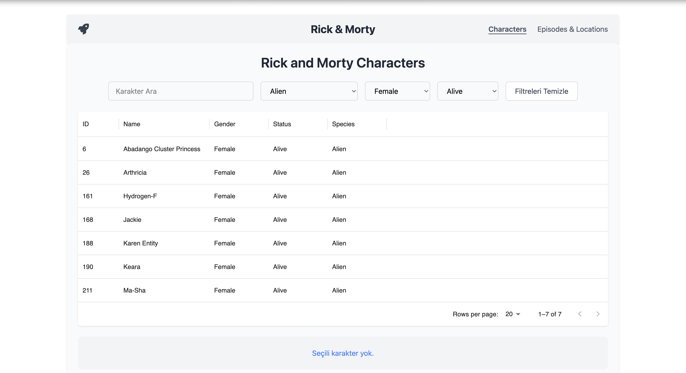
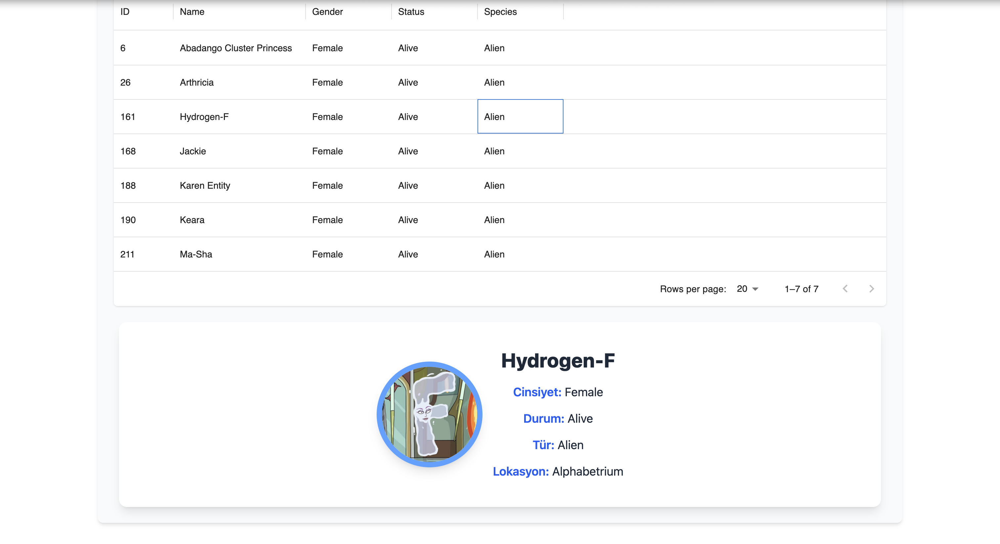
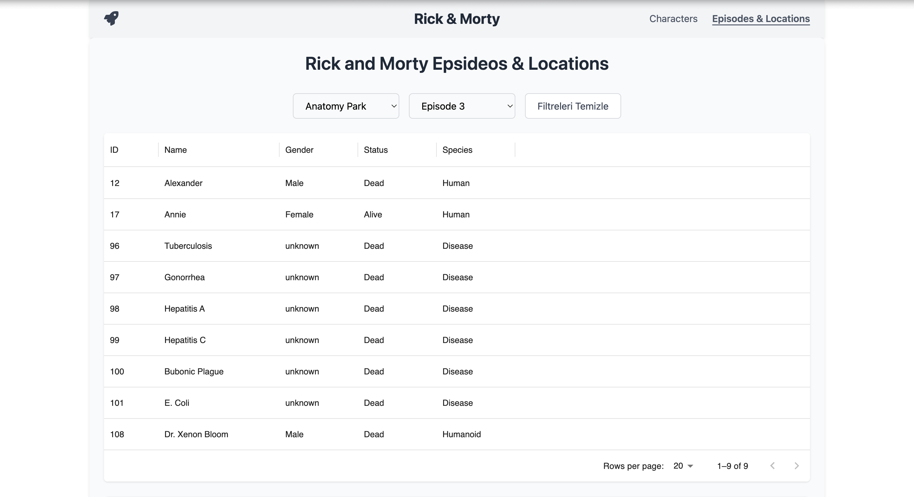

# 🧬 Rick and Morty Karakter Uygulaması

Bu React tabanlı web uygulaması, [Rick and Morty API](https://rickandmortyapi.com/) üzerinden karakterleri çekerek kullanıcıya tablo halinde sunar. Kullanıcı, karakterleri lokasyon ve episode ID'lerine göre filtreleyebilir. Ayrıca bir karaktere tıklandığında detaylı bilgiler gösterilir.

---

## 🚀 Özellikler

- 📋 **Karakter Tablosu:** DataGrid ile listeleme
- 🔍 **Filtreleme:** Lokasyon ve episode ID’ye göre filtreleme
- 📌 **Detay Paneli:** Seçilen karakterin detaylı bilgileri
- 🎨 **Modern Arayüz:** Tailwind CSS ile responsive tasarım
- ⚛️ **Redux ile Global State Yönetimi**
- ⚡️ **Hızlı Performans:** İlk 250 karakterde çalışma

---

## 🛠️ Kullanılan Teknolojiler

| Teknoloji        | Açıklama                                          |
|------------------|---------------------------------------------------|
| **React**        | UI oluşturmak için JavaScript kütüphanesi         |
| **Redux Toolkit**| Global state yönetimi için                       |
| **Axios**        | API'den veri çekmek için HTTP istemcisi           |
| **Tailwind CSS** | Modern, hızlı ve özelleştirilebilir CSS framework |
| **MUI DataGrid** | Güçlü ve etkileşimli tablo bileşeni               |
| **Rick & Morty API** | Açık kaynak karakter veritabanı               |

---

## 🌐 Canlı Yayın

Projeyi canlı olarak aşağıdaki adresten inceleyebilirsiniz:

[https://gokce227.github.io/Rick-and-Morty-Table](https://Gokce227.github.io/Rick-and-Morty-Table/#/
)


## 📸 Uygulama Görünümü






## 🧰 Kurulum ve Çalıştırma

### 1. Bu projeyi klonlayın:
```bash
git clone https://github.com/kullaniciadi/rick-and-morty-app.git
cd rick-and-morty-app
``` 
### 2.Gerekli bağımlılıkları yükleyin:
```bash
npm install
```

### 3.Geliştirme sunucusunu başlatın:
```bash
npm run dev
# veya
npm start
```

### 4.Tarayıcınızda şu adresi açın:
```bash
http://localhost:3000 

```
## 📌 Uygulama Özellikleri Detaylı
🔎 Filtreleme Seçenekleri
- Lokasyon Filtresi: Karakterin bulunduğu yeri seçerek filtreleme yapılabilir.
- Episode ID Filtresi: Karakterin bulunduğu bölümlere göre filtreleme yapılabilir.
- Filtre Temizleme Butonu: Seçilen tüm filtreleri sıfırlar.

## 📋 DataGrid Tablonun Yapısı

| Sütun   | Açıklama                   |
| ------- | -------------------------- |
| ID      | Karakterin benzersiz ID'si |
| Name    | Karakterin adı             |
| Gender  | Cinsiyet bilgisi           |
| Status  | Yaşayıp yaşamadığı bilgisi |
| Species | Tür bilgisi (örnek: Human) |

## 🧍 Karakter Detay Paneli
- Bir satıra tıklanınca karakter detayları ekranda gösterilir. Bu detaylar CharacterTableDetail bileşeni ile sunulur.

## 🧪 Teknik Notlar
- getCharacters Redux slice'ı ile API'den veriler çekilir.
- API’den çekilen veriler global state'e kaydedilir.
- Filtreler state olarak yönetilir ve filtreleme zincirleme .filter() fonksiyonlarıyla yapılır.
- Eğer filtrelenen sonuçlarda karakter yoksa kullanıcıya özel bir mesaj gösterilir: "Uygun karakter bulunamadı."


## 📄 Lisans
- Bu proje MIT Lisansı ile lisanslanmıştır. Dilediğiniz gibi kullanabilir ve geliştirebilirsiniz.

